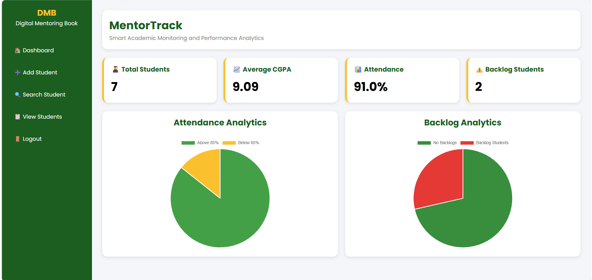

# MentorTrack

MentorTrack is a web-based Student Academic Monitoring and Analytics System developed using Python Flask and DBM Database.

## Features

- Admin Login
- Add Student
- Search Student
- Edit Student
- Delete Student
- USN Validation
- Duplicate USN Prevention
- Attendance Analytics
- Backlog Analytics
- Dashboard Statistics
- Pie Chart Visualization

## Technologies Used

- Python
- Flask
- DBM
- HTML
- CSS
- Jinja2
- Chart.js

## Dashboard Preview

## Developer

Mohamed Arif M

Vidyavardhaka College of Engineering, Mysore
